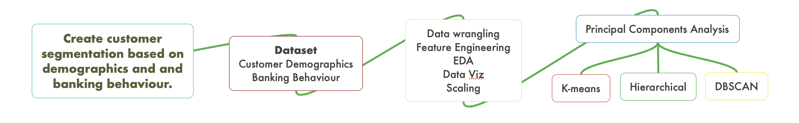
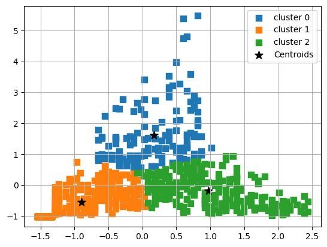
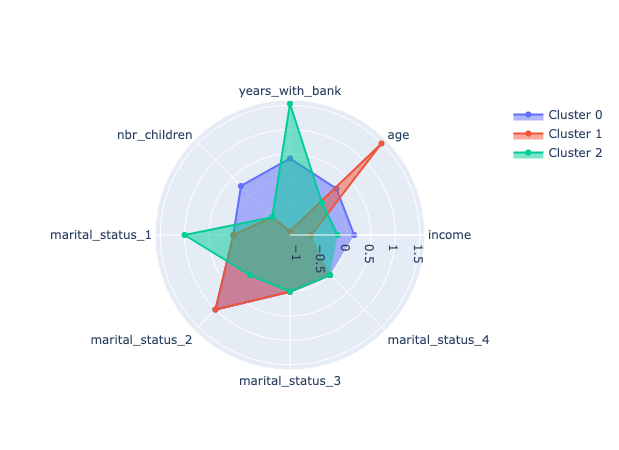
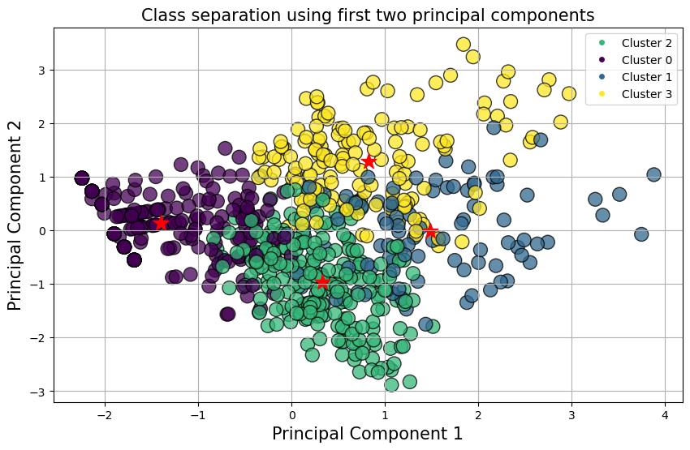
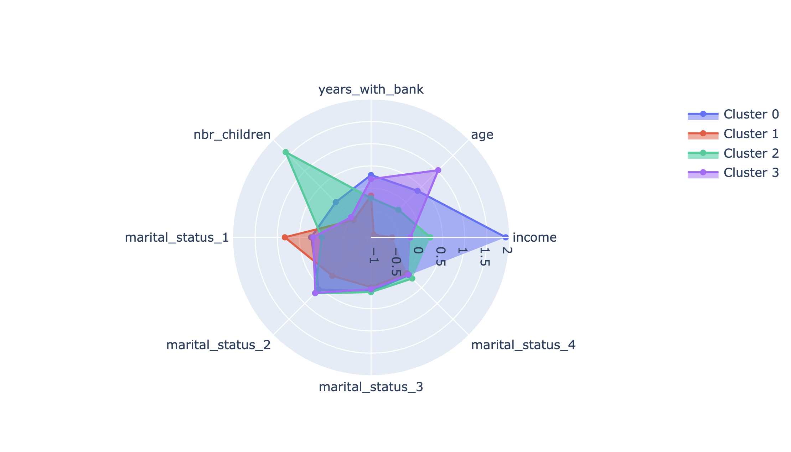
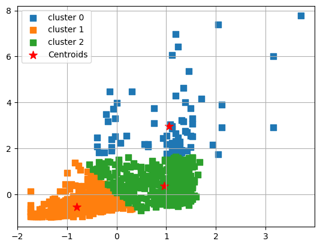
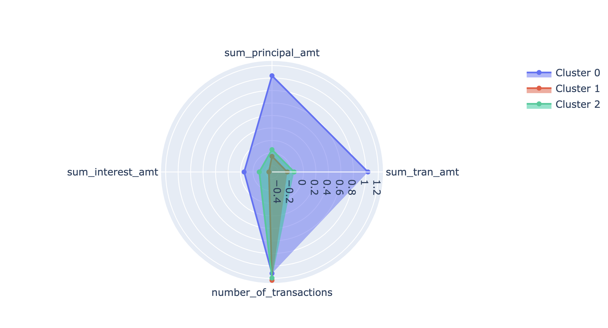
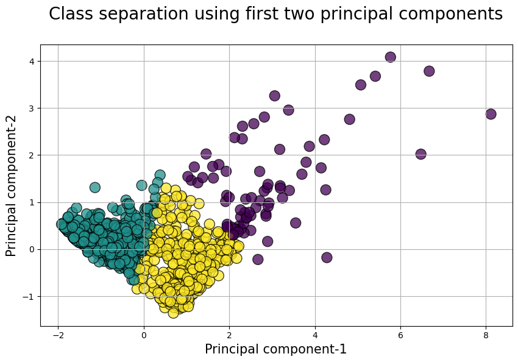
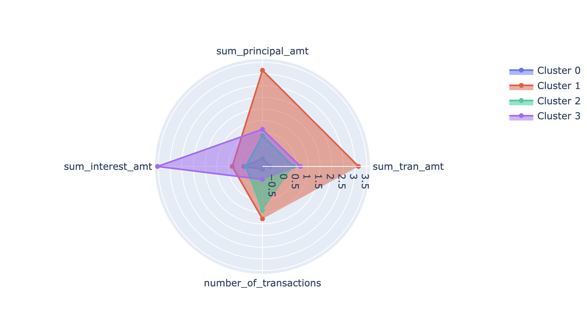

# Clustering Project

## Goal:

The goal of this project is to create customer segmentation based on demographics and and banking behaviour.

## Process

## 1. Customer demographics.
_In customer foler_

|Process |   Notebook |
|:-|:-|
|Data wrangling |***Data_Prep.ipynb***|
|Feature engineering|***Data_Prep.ipynb***|
|EDA|***EDA.ipynb***|
|Data visualization |***EDA.ipynb***|
|Scaling|***EDA.ipynb***|
|Dimensionality reduction using Principal Components Analysis |***Clustering.ipynb***|
|Segmentation with K-means, Hierarchical, and DBSCAN|***Clustering.ipynb***|

## 2. Banking behaviour.
_In the transactions folder_

|Process|   Notebook|
|--------|--------|
|Data wrangling |***Data_Prep.ipynb***|
|Feature engineering|***Data_Prep.ipynb***|
|EDA|***Data_Prep.ipynb***|
|Data visualization |***Data_Prep.ipynb***|
|Scaling|***Data_Prep.ipynb***|
|Dimensionality reduction using Principal Components Analysis (PCA) |***Clustering.ipynb***|
|Segmentation with K-means, Hierarchical, and DBSCAN|***Clustering.ipynb***|

## Results

**Demographic Segmentation.**

Highlights:

We derived three segmentations using K-means. Demographically, the first cluster is young and low income; cluster 2 is older and middle income, cluster three is mostly middle age and high income.

After dimensionality reduction with PCA and using the first two principal components, the the optimal clustering was 4. The first segmentation, cluster 0 is mainly middle aged and high income. Cluster 1 is young low income earners. Cluster 2 is middle aged and average income. Cluster 3 is the oldest and middle income class.

Other clustering methods were employed during this exercise, the results can be found in the appropriate notebook(s).

> Before PCA
>
> > Scatter plot of clusters with income and age.

>> Radar of clusters with K-means clustering

> After PCA
>
> > Segmentation using the first two principal components

>> Radar of clusters after PCA

**Banking behaviour.**

Analysis focused on segmenting customers based on transaction behaviour — are they making lot of small transactions or few huge ones?

Before dimensionality reduction with PCA, we derived three clusters. The first segment (cluster 0) is customers making high numbers of huge transactions. The second segment (cluster 1) are customers making few small transactions. The third segment (cluster 2) are customers making average (number and total) transactions.

After PCA reduction and using the first two principal components.
There were four segments. The first segment (cluster 0) are customers making small few transactions. The second segment (cluster 1) are customers making large many transactions. The third segment (cluster 2) are customers making many small transactions. The fourth segment (cluster 3) are customers few small transactions but paying the highest interest on transactions.

A cluster plot is depicted below

> Before PCA
>
> > Scatter plot of clusters with number of transactions and transaction amount.

>> Radar of clusters with K-means clustering

> After PCA
>
> > Segmentation using the first two principal components

>> Radar of segmentation for banking behaviour after PCA.

Other clustering methods beyond k-means were employed during this exercise, the results can be found in the appropriate notebook(s).

## Challenges
PCA algorithm has a steep learning curve. It was challenging to make clusters after dimensionality reduction with PCA.

## Future Work
- Learn more tools and plotting techniques.
- Experiment with LDA and other dimensionality reduction algorithms.
- Supervised machine learning
