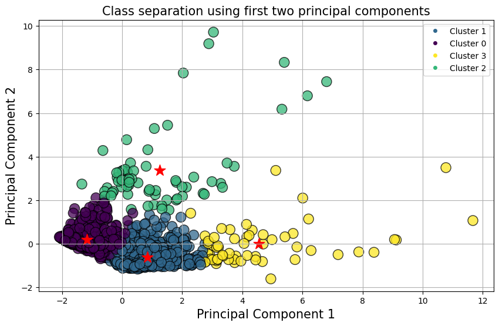
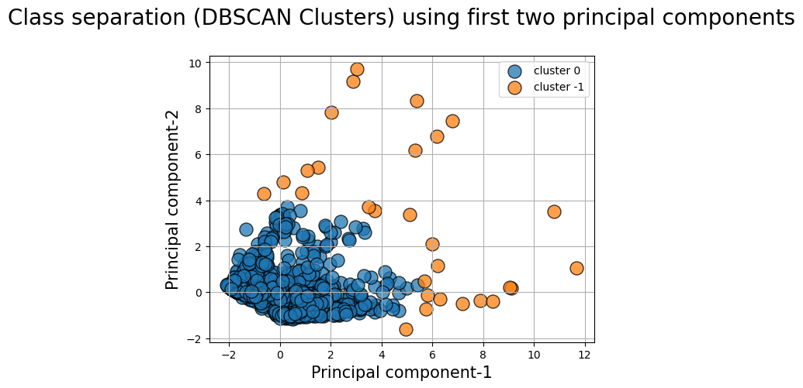

# Clustering Project

## Goal:

The goal of this mini-project is to create customer segmentation based on demographics and and banking behavior. 

## Process

## 1. Customer demographics. We used customer data from ***twm_customer.csv**

|Process|   Notebook|
|--------|--------|
|Data wrangling |***Data_Prep.ipynb***|
|Feature engineering|***Data_Prep.ipynb***|
|EDA|***EDA.ipynb***|
|Data visualization |***EDA.ipynb***|
|Scaling|***EDA.ipynb***|
|Dimensionality reduction using Principal Components Analysis |***Clustering.ipynb***|
|Segmentation with K-means, Hierarchial, and DBSCAN|***Clustering.ipynb***|

## 2. Banking behavior. We used transaction data from ***twm_transaction.csv**

   
|Process|   Notebook|
|--------|--------|
|Data wrangling |***Data_Prep.ipynb***|
|Feature engineering|***Data_Prep.ipynb***|
|EDA|***Data_Prep.ipynb***|
|Data visualization |***Data_Prep.ipynb***|
|Scaling|***Data_Prep.ipynb***|
|Dimensionality reduction using Principal Components Analysis (PCA) |***Clustering.ipynb***|
|Segmentation with K-means, Hierarchial, and DBSCAN|***Clustering.ipynb***|
  

## Results

**Demographic results.**
We derived three segmentations using K-means. The results were the same before and after dimensionality reduction with PCA. The elbow rule and shilouette coefficients were used to evaluate optimal number of clusters are appropiate for the dataset.
A radar plot of the clusters are depicted below. 

**Banking behavior.**
Our analaysis focused on clustering customers based on transaction behavior — are they making lot of small transactions or few huge ones?
After evaluation of K-means, Agglomerative, and DBSCAN results, we concluded that K-means gave the best clustering of three clusters after PCA.
A cluster plot is depicted below

## Challenges
PCA algorithm has a steep learning curve. It was challenging to make clusters after dimensionality reduction with PCA.
Becuse we had only two features for banking bahavior, radar plots were not comprehsnsible. A more easier visual would be to make a bar plot, but we couldnt easily plot after clustering.  

## Future Work
Learn more tools and plotting techniques. 
More projects with PCA and different dimensionality reduction techniques to accquire fluency and confidence in executing them. 